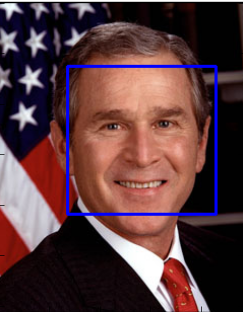
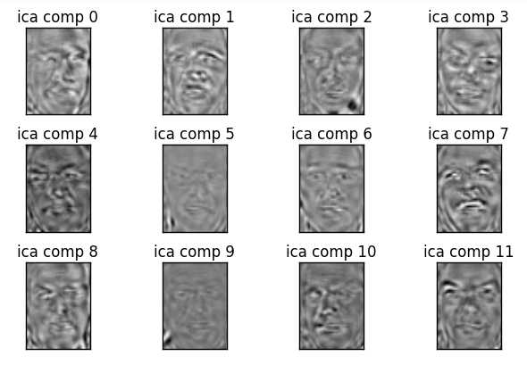
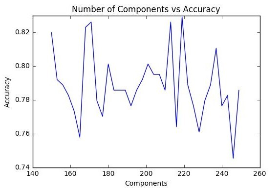

We present an approach to the detection and
identification of human faces and describe a working, near realtime
face recognition system which recognizes the person by
comparing characteristics of the face to those of known individuals.

# Face detection
Viola Jones detector which is used for face detection
performs much better and can detect faces in real time. It can
detect faces irrespective of their scale and position. A result is
shown here by using the image of George Bush. This is not
cherry picked but just a random image on the Internet.

# Methods used:
## Independent component analysis
The top 12 ica components are shown here below.The
Image does not look as much intuitive as PCA eigen faces.But
the structure and relative position of nose, eye’s, eye brow’s,
lips etc; is still maintained

## Non negative matrix factorization
The highest accuracy for NMF can
achieved with projecting onto 219 components and the accuracy
is 82.9%.This is comparable to PCA and ICA but lesser
than both of them.

